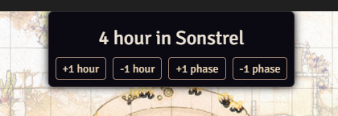

# Simple Phase Tracker
Simple phase tracker is a module for Foundry VTT.

##  Feature
Display the time in phases on top of the scene.

- **What is a phase ?** Anything you want. Can be morning, afternoon, night or fantasy times.
- **How much a phase last ?** As long as you want, you decide. For now, every phase duration is the same. We will add custom phase duration later.
- **How many phase can I have ?** As many as you want.
- **How do I progress in the phases ?** 4 buttons (only for GM role) : 2 for progressing inside the phase, and 2 to move phases.
- **Is it only hour by hour ?** For now yes, but later the step will be customizable (day, month or your input).
- **Can I hide it / move it?** Yes, it's collapsable and draggable.

